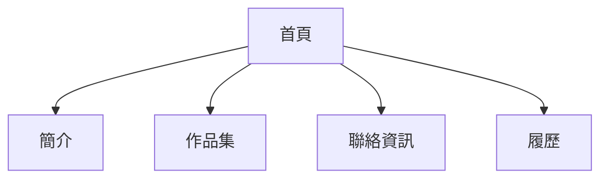
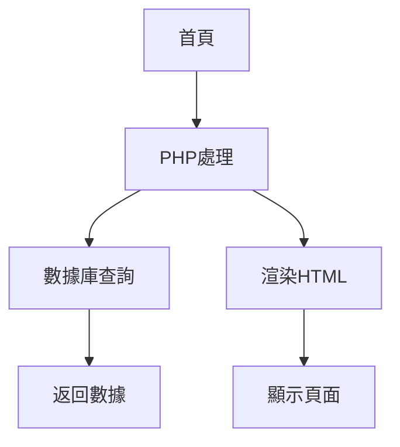
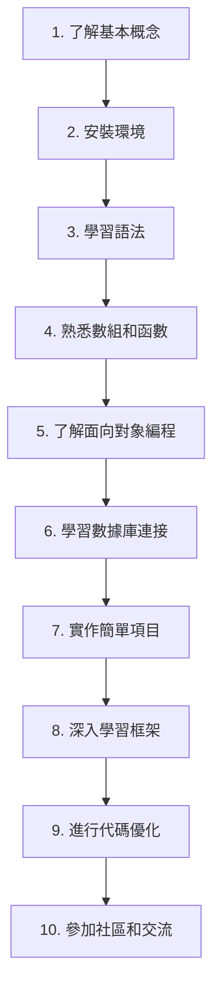

https://github.com/cayman718/web_2024_1008_18.git
![[18-v2.png]]

```mermaid
graph TD;
    A[首頁] --> B[簡介]
    A --> C[作品集]
    A --> D[聯絡資訊]
    A --> E[履歷]

```

```mermaid
graph TD;            
    A[首頁] --> B[PHP處理]
    B --> C[數據庫查詢]
    C --> D[返回數據]
    B --> E[渲染HTML]
    E --> F[顯示頁面]
```

```mermaid
graph TD;
    A[1. 了解基本概念] --> B[2. 安裝環境]
    B --> C[3. 學習語法]
    C --> D[4. 熟悉數組和函數]
    D --> E[5. 了解面向對象編程]
    E --> F[6. 學習數據庫連接]
    F --> G[7. 實作簡單項目]
    G --> H[8. 深入學習框架]
    H --> I[9. 進行代碼優化]
    I --> J[10. 參加社區和交流]

```

